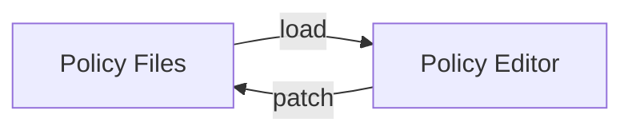

# Diagrams

*Read when deciding whether to use a diagram, selecting its stages, naming its nodes, labeling its edges, or reviewing its depth and scope.*

## Give the Diagram One Job

Give each flow diagram one architectural job, such as tracing a value from source to artifact, showing a request across ownership boundaries, or explaining a state transition. Include only the nodes needed to establish that point. A diagram that tries to inventory every implementation step obscures the transformation the reader needs to understand.

Limit the longest directed path to six nodes. Count nodes rather than arrows, and measure the longest route through the graph rather than the total number of nodes. When a useful flow exceeds that depth, collapse intermediate implementation steps into one named transformation or split the diagram at a meaningful ownership, representation, or lifecycle boundary.

Prefer node labels of one to three words, with shorter labels when they remain specific. Choose grammar by semantic role:

- Use noun phrases for actors, inputs, outputs, states, stores, and artifacts, such as `Source Types`, `Generated Schemas`, and `Artifact Store`.
- Use active verb phrases for operations and transformations, such as `Generate Schemas`, `Validate Config`, and `Encode Artifacts`.
- Mix noun and verb labels when the diagram contains both things and operations. Do not force one grammatical form across unlike roles merely to create visual symmetry.

Reserve a node for an operation when the transformation matters to the architectural point. Put a verb on an edge when the action only explains the relationship between two important things. For example, `Source Types -->|generate| Schemas` emphasizes the two representations, while `Source Types --> Generate Schemas --> Schemas` emphasizes schema generation as an independently important stage.

Treat an unlabeled bidirectional edge as ambiguous unless the surrounding model already defines one symmetric relationship. Use one relationship label when both directions carry the same meaning, such as two peers that `synchronize`. Split the edge when each direction performs different work:

The two edges distinguish how authored content enters the editor from how editor actions return to source. Do not compress different operations into a label such as `reads/writes` when their direction, ownership, or representation matters to the architectural point.

Audit every diagram with these questions:

- **Point:** Which relationship or transformation should the reader understand after reading it?
- **Selection:** Does every node contribute to that point?
- **Depth:** Does every directed path contain no more than six nodes?
- **Role:** Does each label identify a thing or state with a noun, and an operation with an active verb?
- **Direction:** Does every bidirectional relationship use one symmetric label or two directed labels that expose different operations?
- **Specificity:** Can any label become shorter without becoming ambiguous?
- **Boundary:** Should a long path collapse an implementation detail or split at a real architectural boundary?
